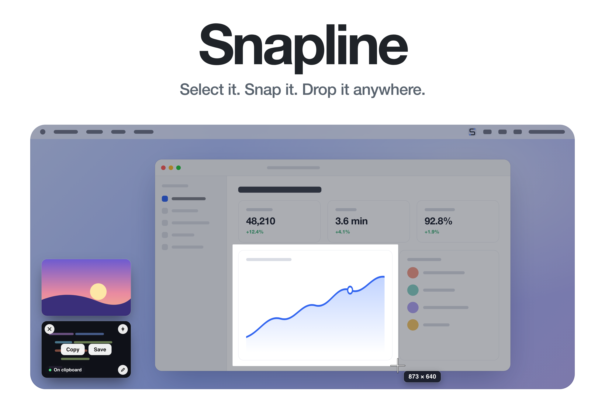
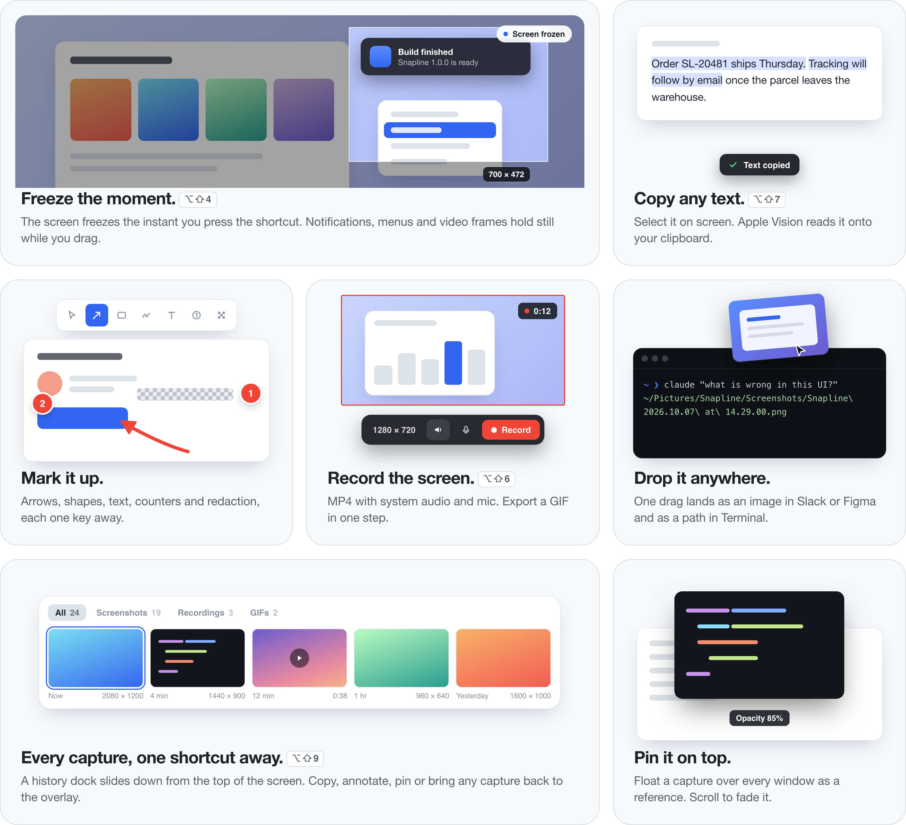
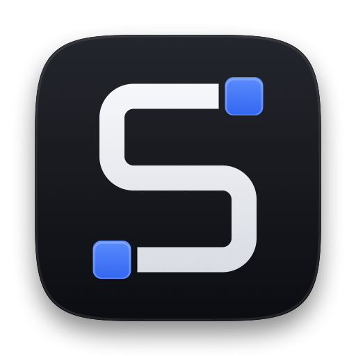

<picture>
  <source media="(prefers-color-scheme: dark)" srcset="docs/hero-dark.png">
  
</picture>

<p align="center">
  Free. Native. For macOS 14 and later.
  <br>
  <a href="../../releases/latest">Download&nbsp;&rsaquo;</a>
  &nbsp;&nbsp;
  <a href="#build-from-source">Build from source&nbsp;&rsaquo;</a>
</p>

<br>

## Capture the exact moment.

Press the shortcut and the screen freezes underneath your pointer.
Notifications, open menus and playing video hold perfectly still while you drag,
and the image you get is cropped from that same frozen frame.

One white line. One size label. Nothing else in the way.

<br>

## Everything a screenshot needs.

<picture>
  <source media="(prefers-color-scheme: dark)" srcset="docs/bento-dark.png">
  
</picture>

<br>
<br>

| | |
|:--|:--|
| <kbd>⌥</kbd>&thinsp;<kbd>⇧</kbd>&thinsp;<kbd>4</kbd> | Capture an area. Return takes the whole screen. |
| <kbd>⌥</kbd>&thinsp;<kbd>⇧</kbd>&thinsp;<kbd>3</kbd> | Capture the display under the pointer. |
| <kbd>⌥</kbd>&thinsp;<kbd>⇧</kbd>&thinsp;<kbd>5</kbd> | Capture a window, with an optional soft shadow. |
| <kbd>⌥</kbd>&thinsp;<kbd>⇧</kbd>&thinsp;<kbd>6</kbd> | Record an area or the full screen. Press again to stop. |
| <kbd>⌥</kbd>&thinsp;<kbd>⇧</kbd>&thinsp;<kbd>7</kbd> | Copy the text inside a selection. |
| <kbd>⌥</kbd>&thinsp;<kbd>⇧</kbd>&thinsp;<kbd>8</kbd> | Capture the previous area again. |
| <kbd>⌥</kbd>&thinsp;<kbd>⇧</kbd>&thinsp;<kbd>9</kbd> | Open the capture history. |

Every shortcut can be changed in Settings, and Snapline warns you when another app already owns one.

<br>

## Straight from shortcut to wherever it goes.

Each capture floats in the corner of your screen the moment you take it.
Click to copy. Hover to save, pin or annotate. Drag it out to use it.

A single drag carries the image, the file and its path at once,
so it lands as a picture in Slack, Figma or Mail,
and as a ready to run path in Terminal or an agent prompt.

<br>

## Mark it up without leaving the flow.

Arrows, lines, shapes, freehand, highlighter, text, numbered counters,
pixelate and crop, each on a single key. Add a gradient background,
padding and a shadow when it is going somewhere public.
**Done** writes your edits back, copies the result and floats it on the overlay again.

<br>

## Private by design.

No account. No cloud. No analytics.
Snapline runs entirely on your Mac, and your captures never leave it.
Everything is filed under `~/Pictures/Snapline` in Screenshots, Recordings and GIFs.

<br>

## Tech Specs

| | |
|:--|:--|
| **Compatibility** | macOS 14 Sonoma or later, on Apple silicon. |
| **Size** | 3.1 MB |
| **Built with** | Swift, AppKit, SwiftUI, ScreenCaptureKit, Vision. No third party code. |
| **Formats** | PNG and JPG stills, H.264 MP4 at 30 or 60 fps, GIF |
| **Recording audio** | System audio, plus microphone on macOS 15 and later |
| **Network access** | None |
| **Price** | Free |

<br>

## Install

Download the latest build from [Releases](../../releases/latest),
open it and drag Snapline to Applications.

Snapline is signed with a Developer ID but not notarized yet, so the first launch shows a warning.
Open System Settings, go to Privacy & Security, and click Open Anyway next to the message about Snapline.
You only need to do this once.

Snapline needs **Screen Recording** permission. Turn it on under System Settings,
Privacy & Security, Screen & System Audio Recording, then relaunch the app.
**Microphone** access is only asked for if you record your voice.

<br>

## Build from source

```sh
git clone https://github.com/joymadhu49/snapline.git
cd snapline
xcodegen generate
xcodebuild -project Snapline.xcodeproj -scheme Snapline -configuration Release -derivedDataPath build build
open build/Build/Products/Release/Snapline.app
```

Requires Xcode and [XcodeGen](https://github.com/yonaskolb/XcodeGen).
The project signs with Developer ID team `CJZMYQN8V6`. To build under your own account,
change `DEVELOPMENT_TEAM` in `project.yml`, or set `CODE_SIGN_IDENTITY` to `-` for an ad hoc build.

<details>
<summary>Every feature, in detail</summary>
<br>

- **Capture Area** (default ⌥⇧4): frozen screen selection overlay with crosshair, live pixel dimensions, drag to select, Return for the full screen, Esc or right click to cancel. The crosshair and dim appear on the key press itself, and the screen is frozen underneath them a moment later (Snapline's own windows are excluded from that frame, and a selection released before the frame lands waits for it rather than grabbing the live desktop). Notifications, popovers, and video frames stay frozen while you drag; the saved image is cropped from that same frame. Displays are captured concurrently at native resolution. A pure marquee: it never highlights or grabs windows, that is what Capture Window is for. The overlay also never takes focus. The frontmost app stays active, so an open menu, dropdown, or popover stays on screen and lands in the shot instead of being dismissed; Esc, Return, and space still work because the overlay reads the hardware key state directly rather than waiting for key events it would never receive. The chrome is pure Core Animation: layer paths move and nothing redraws a screen sized bitmap, so the marquee tracks the cursor with no lag, across displays too. The chrome is deliberately minimal, CleanShot style: a dimmed screen, one white hairline around the selection, and a small size label riding next to the pointer. With several displays, every one dims, the hint and the crosshair cursor follow the pointer onto whichever display it is on (the pointer is tracked on the overlay's own clock, since macOS delivers mouse moves to a background app's windows unreliably), and a selection stays on the display it started on. While dragging: hold ⇧ for a square, ⌥ to grow from the start point, and space to move the selection without resizing. An optional pixel magnifier (off by default, Settings > General > Show pixel magnifier) zooms the pixels under the pointer
- **Capture Fullscreen** (⌥⇧3): the display under your cursor
- **Capture Window** (⌥⇧5): the overlay highlights the window under the cursor with its name and size, click grabs it (or drag an area instead); clean capture with optional soft shadow on transparent padding
- **Capture Previous Area** (⌥⇧8): repeats the last selection
- **Timed Capture**: select an area, then a 3/5/10 second countdown
- **Record Screen** (⌥⇧6): drag out the area and it stays up, CleanShot style: drag the round handles to resize, drag inside to move, and a bar underneath shows the size, toggles system audio, microphone, and cursor (saved to Settings), and starts with **Record** (or ⏎). While recording, one click on the menu bar timer stops it (right click still opens the menu). MP4 via ScreenCaptureKit + H.264, area or full screen, 30/60 fps, system audio, microphone (macOS 15+), optional 3 second count in, red border around the recorded region, elapsed timer in the menu bar, GIF export through Homebrew ffmpeg
- **Capture Text** (⌥⇧7): OCR any frozen screen region through Apple Vision, result lands on the clipboard
- **Quick Access Overlay**: after every capture the shot itself floats (the card appears straight away; the file is encoded once and the save and clipboard happen in the background) in the bottom left corner, laid out like CleanShot X's overlay: every card the same size (Settings > General > Overlay size: small, medium, or large) so a stack of them stays tidy; cards slide in from past the screen edge, and closing one shrinks and fades it away before the cards above glide down into the gap; on hover the shot dims, Copy and Save (Show in Finder once saved) sit in the middle, and round buttons in the corners close, pin, and annotate it; a successful drag into another app or Finder dismisses the floating card, while a cancelled or rejected drop keeps it available; an "On clipboard" chip marks which capture is currently on the clipboard, clicking the card copies it again, dragging it carries the file out. With two displays the stack follows the pointer: settle on the other display for a moment and the cards rise into its corner, ready to drag into an app there (it never moves mid drag, so dragging a card across to the other display works). The stack grows to as many cards as fit the screen by default; Settings > General > "Overlay holds" caps it lower
- **Capture History** (⌥⇧9): a compact dock across the top of the screen, only as wide as its captures, that scrolls sideways (mouse wheel too) through every recent capture. Filter tabs with counts (All, Screenshots, Recordings, GIFs; empty kinds hide), each tile captioned with its age and pixel size or running time. Click a thumbnail to copy it, drag it out, or hover for Restore to overlay, Annotate, and Copy, with a trash button in the corner and a right click menu for Pin, Open, and Show in Finder. Works from the keyboard: ← → select, Return copies, E annotates, ⌘⌫ trashes. The ⋯ menu opens the captures folder or clears the history (files stay). Esc or a click elsewhere closes it. Restoring a capture that is already on the overlay pulses the existing card instead of stacking a second copy
- **Drag out anywhere**: every card carries the file URL, a shell escaped path, and the image bytes at once, so one drag works in Finder, Slack, and Figma as well as Terminal or an agent prompt. The clipboard carries the same set, so ⌘V pastes the picture in an editor and the path in a terminal
- **Editor**: arrow, line, rectangle, ellipse, freehand, highlighter, text, numbered counters, pixelate redact, crop, undo/redo, single key tool shortcuts (V A L R O P H T N B C), last tool, colour, and stroke remembered between captures, background beautify (gradient presets, padding, corner radius, shadow). The toolbar sits in the title bar row with the window buttons: tools, inline colour swatches (folded into one button on narrow windows), four stroke weights shown as dots, undo/redo, then Background, Drag, Pin, Copy, Save, and **Done** as the one primary button. The window cannot be minimised; it opens wide enough for the fully labelled toolbar and cannot be resized narrower than the compact one (both widths measured from the toolbar itself), and the toolbar picks whichever of its three layouts fits, so it never overflows. Apply Crop sits in the status bar. A status bar shows the result's pixel size and mark count, what the current tool does, and the zoom level; shots are never shown past their real size. Arrows are tapered, counters carry a white ring, and every mark casts a soft shadow so it reads on any background. The canvas draws marks with the same renderer that writes the file, so the screen and the export always match. **Done** (⌘return) writes the edits over the capture's file, puts the result on the clipboard, and floats it back onto the overlay as a card, so the annotated version is what every later copy, drag, or paste hands out; Save and Save As live in the save menu. The **Drag** chip drops the edited image straight into Finder, Slack, a terminal, or an agent prompt without leaving the editor
- **Pin to screen**: floating always on top reference windows; scroll changes opacity, double click closes; also Pin from Clipboard
- **Custom shortcuts** for every action: menu bar icon > Customize Shortcuts (or Settings > Shortcuts tab); click a field, press the new keys; conflict detection included
- **Organized save location**: everything lands in `~/Pictures/Snapline`, filed into `Screenshots/`, `Recordings/`, and `GIFs/` rather than piling up loose on the Desktop; change the root in Settings > Output
- Extras: hide desktop icons toggle, recent captures menu, retina downscale, PNG/JPG, filename pattern `Snapline yyyy.MM.dd at HH.mm.ss`, launch at login

</details>

<details>
<summary>Inside the app</summary>
<br>

| Folder | Role |
|:--|:--|
| `App/` | Entry point, app delegate, and the menu bar item |
| `Core/` | `CaptureEngine` for stills, `RecordingEngine` for video, `CaptureCoordinator` for the flows, `HotkeyCenter`, `SettingsStore`, `ImageWriter`, `GIFExporter`, `OCRService`, `HistoryStore`, `DragOut` |
| `Overlay/` | `SelectionOverlay`, the frozen dim and crosshair on every display, and `HUD` for countdowns and toasts |
| `QuickAccess/` | `QuickAccessPanel`, the floating cards, and `HistoryPanel`, the top dock |
| `Editor/` | `EditorModel`, `EditorCanvas`, `EditorRenderer` for export, `EditorWindow` and its toolbar |
| `Pin/` | `PinWindow` |
| `Settings/` | `SettingsWindow` and `ShortcutRecorder` |

Saved captures go to `~/Pictures/Snapline/<Screenshots|Recordings|GIFs>`. Every capture is
written to a file even when saving is off; those land in
`~/Library/Application Support/Snapline/Captures` so a dragged or pasted path always resolves.

SwiftUI hosting views keep hit testing for everything they draw, so a drag source layered
underneath never sees a mouse down. `DragOut` therefore lets SwiftUI recognise the gesture and
hands the drag to AppKit, which owns the pasteboard flavours.

Coordinate conventions: selection rects travel as global AppKit bottom left origin rects plus their `NSScreen`.
ScreenCaptureKit crops use screen local top left origin points multiplied by `backingScaleFactor`.
Editor annotations live in image pixel space with a top left origin.

**Capture regression tests.** Run `Scripts/test_freeze.sh` from a terminal with Screen Recording access.
It opens a window that changes from red to blue during selection, then checks that both the displayed selection
and its delivered crop keep the red frame. It also checks crop orientation, Retina scaling, offset display
coordinates, cancellation, repeated shortcuts, and live recording, timer and window modes.
Exit code 77 means screen access is unavailable.

**The mark** is the name drawn literally: one line that snaps at right angles into an S, with a square
selection handle on each end, the way a selected path looks in a design tool. `swift Scripts/make_icon.swift`
is the source of truth for the whole identity. It writes `Resources/AppIcon.icns`, the menu bar template
`Resources/MenuBarIcon.pdf`, and the `Brand/` exports.

**The README art** is drawn in HTML under `docs/art/` and rendered in light and dark by
`Scripts/make_readme_art.sh`.

</details>

<details>
<summary>Linux</summary>
<br>

There is an Ubuntu and GNOME port in [`linux/`](linux/README.md): Python and GTK, the XDG portals for
capture and recording, GNOME custom keybindings for the shortcuts, and the same folders and file names.
Run `cd linux && ./install.sh` on the Ubuntu machine.

</details>

<br>

<p align="center">
  
  <br>
  <sub>Designed and built by <a href="https://portfoliojoy-eth.xyz">Joy Madhu</a> in Dhaka.</sub>
</p>
